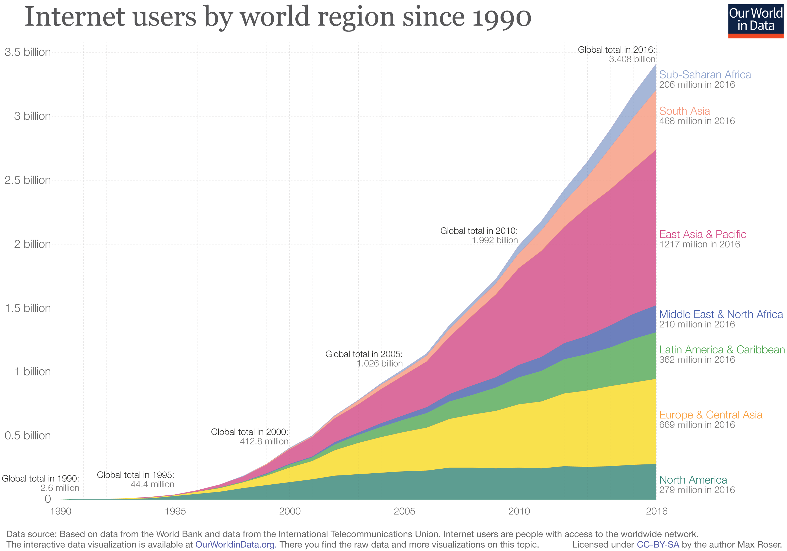

```{r xaringan-themer, include=FALSE, warning=FALSE}
library(xaringanthemer)
  style_mono_accent_inverse(base_color = "#3C989E",
  header_font_google = google_font("Poor Story"),
  text_font_google = google_font("Nanum Gothic"),
  code_font_google   = google_font("Fira Mono"),
  text_font_size = "1.5rem",
  header_h1_font_size = "3.2rem",
  header_h2_font_size = "2.25rem",
  colors = c(
  red = "#f34213",
  purple = "#3e2f5b",
  orange = "#ff8811",
  green = "#136f63",
  white = "#FFFFFF")
  )
source('small_bites.R')
```

layout: true
class: top left spaced animated

---
background-image: url(img/sword_2.jpg)
background-size: cover
class: fadeIn

---
class: fadeIn
background-image: linear-gradient(rgba(0,0,0,.85), rgba(0,0,0,.85)),url(img/ncsoft2.jpg)
background-size: cover


# Who am I  
<br>
<br>
.bigitem[`r icon_check()` &thinsp; PhD in Economics (evolutionary game theory)]

.bigitem[`r icon_check()` &thinsp; Data Center, Lead (Since 2019)]

---
class: highlight-last-item

# 오늘 나눌 이야기 

.bigitem[&thinsp; `r icon_check()` &thinsp; AI 어떻게 흘겨볼 것이냐?]

.bigitem[&thinsp; `r icon_check()` &thinsp; 데이터 과학, 이 시대의 기본기]
 
.bigitem[&thinsp; `r icon_check()` &thinsp; 인문사회계 학생들에게] 

.bigitem[&thinsp; `r icon_check()` &thinsp; 질의 / 응답 (있다면...)]

---
background-image: url(img/Data-Center_wrong.jpg)
background-size: cover
class: center middle animated fadeIn
# <span style="color:black; background-color:gray">&thinsp;Data Center?&thinsp;</span>

---
background-image: linear-gradient(rgba(0,0,0,.85), rgba(0,0,0,.85)),url(img/Data-Center_wrong.jpg)
background-size: cover
class: center middle animated fadeIn

# 부서 이름입니다만...

---
# Data Center에서 무엇을 하나요?

+ 떨어지는 로그 데이터를 관리하기 위한 소프트웨어 기반 유지 

+ 데이터로 분석 하기 

+ 분석된 데이터로 커뮤니케이션 하기 
  
---
class: left, top
background-image: url(img/dc-infra.png)
background-size: contain

.bigitem[다루는 데이터 규모]

---
class: left, top
background-image: url(img/peta.jpg)
background-size: cover


---
class: center, middle
background-image: linear-gradient(rgba(0,0,0,.9), rgba(0,0,0,.9)),url(img/peta.jpg)
background-size: cover
class: center, left, fadeIn
<br>
<br>
<br>
### 1 Byte = $2^8$ bit 
### 1 KB = $2^{10}$ Byte $\approx$ 1,000 Byte
### 1 MB = ${\rm 1KB}^3 \approx 10^{3+3}$ Byte
### 1 GB = ${\rm 1KB}^6 \approx 10^{3+6}$ Byte


---
background-image: linear-gradient(rgba(0,0,0,.85), rgba(0,0,0,.85)),url(img/question-marks.jpg)
background-size: cover
class: top, left, animated, none

# Questions for You  

--

.bigitem[&thinsp; `r icon_comment()` &thinsp; AI 하면 무엇이 떠오르나요?] 

--

.bigitem[&thinsp; `r icon_comment()` &thinsp; AI는 정확한 표현인가요?]

--

.bigitem[&thinsp; `r icon_comment()` &thinsp; 우리가 매일 접하고 있는 AI는 무엇인가요?] 

---
# Fundamental Q for AI 


.pull-left[


]

.pull-right[

" <br />
우리가 본 것에서 시작한 일반화를 보지 못한 것까지 적용하는 일은 어떻게 정당화할 수 있는가? <br />

"

]

---
background-image: url(img/terminator.gif)
background-size: cover

.biggitem[(Too Short) History of AI]

---
class: top, left, highlight-last-item, fadeIn

# 인공신경망(artificial neural net)

+ Mcculloch & Pitts (1943) 

--

+ 인간의 신경망이 작동하는 방식을 본딴 알고리즘


---
background-image: url(img/1_3nMF3cYJDopFnVagAK7Thw.png)
background-size: cover
class: center, middle, animated, fadeIn

---
background-image: url(img/qrrettswrqx.gif)
background-size: cover
class: center, middle, animated, fadeIn

---
background-image: url(img/Neurons_all_16_large_BlackBG-Reid-2.jpg)
background-size: cover
class: center, middle, animated, fadeIn

---
background-image: url(img/whitebg.jpg)
background-size: cover
class: left, bottom, animated, fadeIn

 <br />
.black.small[From: https://brunch.co.kr/@hvnpoet/61]


---
background-image: url(img/neural_net.png)
background-size: contain
class: center, middle, animated, fadeIn

---
background-image: url(img/whitebg.jpg)
background-size: cover
class: left, middle, animated, fadeIn, inverted

<center>

</center>

.black.small[From: https://ai.plainenglish.io/the-rise-and-fall-of-the-perceptron-c04ae53ea465]

---
class: highlight-last-item, fadeIn

#  Perceptron 

+ 퍼셉트론이란? 

  + 하나의 층을 지닌 인공 신경망의 온전한 알고리즘 (Frank Rosenblatt)

--

+ XOR를 분류할 수 있는가? 

  + XOR: Exclusive OR 

---
background-image: url(img/whitebg.jpg)
background-size: cover
class: left, bottom, animated, fadeIn, inverted

<center>

</center>

.black.small[From: https://wiserloner.tistory.com/245]


---
class: highlight-last-item, fadeIn

# Expert System 

+ 인간의 논리적 추론 과정을 모방 

--

+ 주어진 사실(공리)에서 다른 형태의 결론(정리)를 끌어내는 추론 과정을 적용

--

+ 이를 자동화할 수 있다면? 

---
background-image: url(img/whitebg.jpg)
background-size: cover
class: left, middle, animated, fadeIn, inverted

<center>

</center> 

.black.small[From:
https://moral-robots.com/technology/what-are-expert-systems/]

---
class: highlight-last-item, fadeIn

# Expert System의 한계  

+ 인간의 지식은 얼마나 규칙으로 만들 수 있는가? (지식 추출의 병목현상)

  + Tacit vs Explicit 

--

+ 지식은 계속해서 변한다! 

  + 이를 유연하게 반영할 수 있는 일반적인 지적, 공학적 구조가 있을까? 

--

+ 의외로 단순하지 않더라... 

  + 익스퍼트 시스템 기반 번역 알고리즘 및 소프트웨어의 처참한 실패 


---
background-image: linear-gradient(rgba(0,0,0,.7), rgba(0,0,0,.7)),url(img/night-king-hbo-got-hack-740x432.png)
background-size: cover
class: center, middle, animated, fadeIn

.biggitem[80년대 그리고 90년대의 AI 겨울]

---
background-image: url(img/whitebg.jpg) 
background-size: cover
class: left, bottom, animated, fadeIn, inverted

<center>

</center> 

.black.small[From:
https://www.f5.com/es_es/company/blog/aI-and-the-role-of-application-services]

---

# AI의 부활 

## data! data! data! 

+ Internet! Internet! Internet!
+ Yahoo, Google, Facebook...
+ 엄청난 량의 데이터가 폭발적으로 쌓이기 시작했다.  

--

## 쉬워진 하드웨어의 확장

+ 클라우드 컴퓨팅의 등장 
+ 동원 가능한 대규모 '범용' 머신의 등장 

---
background-image: url(img/whitebg.jpg)
background-size: cover
class: left, middle, animated, fadeIn, inverted

<center>

</center>

.black.small[From:
https://ourworldindata.org/grapher/internet-users-by-world-region]

---

# 딥러닝의 부상 

+ 이미지 인식 분야에서 먼저 탁월한 성과를 거두기 시작

+ 방법론과 이론은 2000년 초반에 이미 완성
  + 다층 신경망(multi-layer neural net)
  + 역전파 (back propagation)

+ 적용 및 최적화는 2010년대에 걸쳐 눈부시게 발전 

---
background-image: url(img/A-biological-neuron-in-comparison-to-an-artificial-neural-network-a-human-neuron-b.png)
background-size: contain
class: left, bottom, animated, fadeIn


---
background-image: url(img/SE_Nov_Article_-figure-1.jpg)
background-size: contain
class: left, middle, animated, fadeIn, inverted


---

# 딥러닝의 약진 

+ 이미지 인식 분야에서 큰 성공을 거두고 다른 분야로 진출

+ 그럴 듯한 가상 이미지 생성 (GAN) [LINK](https://www.tensorflow.org/tutorials/generative/dcgan) 

+ 음성 인식 

+ 강화 학습 (알파고, 알파스타, 알파폴드2) [LINK](https://www.tensorflow.org/agents/tutorials/0_intro_rl)

+ 자연어 처리 (GPT-3) [자세한](https://www.youtube.com/watch?v=MV1l2JPAxVY) [간략한](https://www.youtube.com/watch?v=YTKjtKMGCwA)

---
background-image: url(img/whitebg.jpg)
background-size: cover
class: left, middle, animated, fadeIn, inverted

<center>


---
background-image: url(img/whitebg.jpg)
background-size: cover
class: left, middle, animated, fadeIn, inverted

<center>


---

# Bigger, Faster and Smarter 


- 더 뛰어난 AI를 만들기 위한 경쟁 

- 알고리즘의 문제? 

- 더 많은 데이터를 더 영리하게 학습시키는 것의 문제 

---
background-image: url(img/whitebg.jpg)
background-size: cover
class: left, middle, animated, fadeIn, inverted

<center>


</center>
.black.small[From: https://ark-invest.com/big-ideas-2021/]


---
background-image: url(img/ark_2021_2.png)
background-size: contain
class: left, middle, animated, fadeIn, inverted


---
class: highlight-last-item, fadeIn

# 데이터는 쓰레기에 불과하다... 


+ '빅' 데이터란 무엇인가? 

--

+ 데이터가 그냥 쌓여 있다고 통찰이 마법같이 떠오를까? 

--

+ 데이터란 보는 사람의 시선에 따라 조직되기 마련이다. 

---
background-image: url(img/gameplaying.gif)
background-size: cover
class: left, top, animated, fadeIn
### <span style="color:black; background-color:gray">&thinsp;당신이 게임을 즐길 때... game...&thinsp;</span> 

---
background-image: url(img/NC_MMORPG.png)
background-size: contain
class: left, top, animated, fadeIn
### The other side of playing 

---
background-image: url(img/hdfs.png)
background-size: contain
class: left, top, animated, fadeIn

---
background-image: url(img/log.png)
background-size: cover
class: center, middle, animated, fadeIn
##<span style="color:black; background-color:gray">&thinsp;logs라는 녀석은...&thinsp;</span> 

---
background-image: linear-gradient(rgba(0,0,0,.85), rgba(0,0,0,.85)),url(img/log.png)
background-size: cover
class: center, middle, animated, fadeIn
## 비밀을 알지 못하면 아무 의미 없다. 


---
background-image: url(img/matrix_neo.gif)
background-size: cover
class: center, middle, animated, fadeIn

---
background-image: linear-gradient(rgba(0,0,0,.85), rgba(0,0,0,.85)),url(img/matrix_neo.gif)
background-size: cover
class: center, middle, animated, fadeIn
## 로그를 어떻게 의미있는 정보로 바꿀 수 있을까?  

---
background-image: url(img/whitebg.jpg)
background-size: cover
class: left, middle, animated, fadeIn, inverted

<center>


</center>

---
background-image: url(img/TSD라떼말.jpg)
background-size: cover
class: left, middle, animated, fadeIn, inverted

---
background-image: linear-gradient(rgba(0,0,0,.8), rgba(0,0,0,.8)), url(img/TSD라떼말.jpg)
background-size: cover
class: left, middle, animated, fadeIn, inverted

.white.large[마지막 조언...]

---
# 외국어를 배우는 이유? 

- (시험을 잘 보기 위해서?)

- 견문과 지식을 넓히기 위해서? 

- 더 많은 네트워크에 닿기 위해서? 

---
# 어떤 언어를 잘 한다는 의미는? 

- (높은 시험 점수?)

- 그 나라의 언어를 이해한다. 

- 그 나라의 언어를 말하고 쓸 줄 안다. 

---
# 가장 중요한 외국어는? 

- 컴퓨터와 대화할 수 있는 언어 

- 데이터를 다루기 위해서, 알고리즘을 부리기 위해서 

- 인문계든 자연계든 코딩을 피해갈 수는 없다! 

---
# 외국어를 배울 때와 마찬가지로... 

- 보기만 할 줄 아는, 듣기만 할 줄 아는 외국어 실력은 온전하지 않다.  

- 의사소통을 위해서 글을 쓰고 말을 하듯이 

- 해결하려는 문제를 정의하고 이를 코딩으로 풀어봐야 한다. 

- 혼자말이 되지 않으려면 도구에 익숙해지고, 직접 뛰어들자! 


---
class: fadeIn 

# 꼭 알면 좋을 것 

- Git / Github 

--

- Python, R, Visual Studio Code  

--

- (좀 더 가고 싶다면) Java, Javascript, React, Go 


---
background-image: url(img/git_github.jpg)
background-size: cover
class: left, middle, animated, fadeIn, inverted

---
# 방문해 볼 곳 

- [Google Colab](https://colab.research.google.com/notebooks/intro.ipynb)

- [Github](https://github.com/)


---
layout:false
class: center, middle
background-image: url(img/penguin.gif)
background-size: cover

# Q & A


---
background-image: linear-gradient(rgba(0,0,0,.8), rgba(0,0,0,.8)), url(img/sources.png)
background-size: cover
class: left, top, animated, fadeIn

# 더 관심이 있다면... 

- 코딩 없이 ML 체험하기 [LINK](https://teachablemachine.withgoogle.com/)

- ML 기본 모델 해설 [LINK](https://medium.com/@jongdae.lim/%EA%B8%B0%EA%B3%84-%ED%95%99%EC%8A%B5-machine-learning-%EC%9D%80-%EC%A6%90%EA%B2%81%EB%8B%A4-part-1-9a0297198ad8)

- ML의 역사와 이론 [LINK](https://www.aladin.co.kr/shop/wproduct.aspx?ItemId=87212039)
