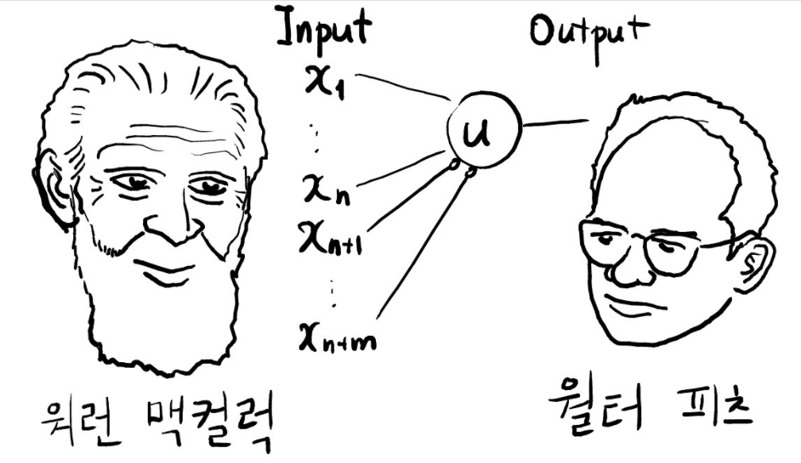
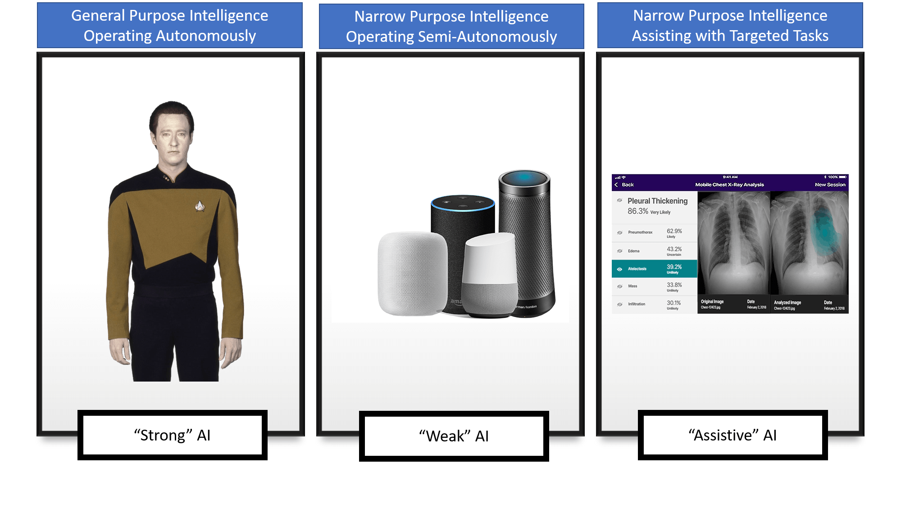
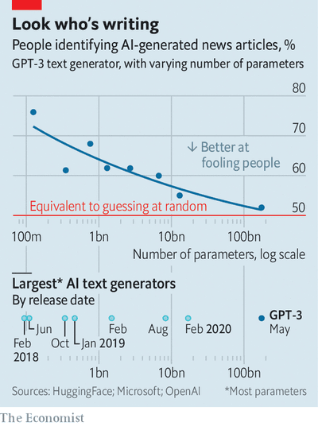

```{r xaringan-themer, include=FALSE, warning=FALSE}
library(xaringanthemer)
  style_mono_accent_inverse(base_color = "#3C989E",
  header_font_google = google_font("Poor Story"),
  text_font_google = google_font("Nanum Gothic"),
  code_font_google   = google_font("Fira Mono"),
  text_font_size = "1.5rem",
  header_h1_font_size = "3.2rem",
  header_h2_font_size = "2.25rem",
  colors = c(
  red = "#f34213",
  purple = "#3e2f5b",
  orange = "#ff8811",
  green = "#136f63",
  white = "#FFFFFF")
)
source('small_bites.R')
```

layout: true
class: top, left, spaced, animated, fadeIn

---
background-image: url(img/sword_2.jpg)
background-size: cover

---
background-image: linear-gradient(rgba(0,0,0,.85), rgba(0,0,0,.85)),url(img/ncsoft2.jpg)
background-size: cover

# Who am I  
<br>
<br>
.bigitem[`r icon_check()` &thinsp; PhD in Economics (evolutionary game theory)]

.bigitem[`r icon_check()` &thinsp; Data Center, Lead (Since 2019)]

---
class: highlight-last-item

# 오늘 나눌 이야기 

.bigitem[&thinsp; `r icon_check()` &thinsp; AI 어떻게 흘겨볼 것이냐?]

.bigitem[&thinsp; `r icon_check()` &thinsp; 데이터 과학, 이 시대의 기본기]
 
.bigitem[&thinsp; `r icon_check()` &thinsp; 인문사회계 학생들에게] 

.bigitem[&thinsp; `r icon_check()` &thinsp; 질의 / 응답 (있다면...)]

---
background-image: url(img/Data-Center_wrong.jpg)
background-size: cover
class: center, middle, animated, fadeIn
# <span style="color:black; background-color:gray">&thinsp;Data Center?&thinsp;</span>

---
background-image: linear-gradient(rgba(0,0,0,.85), rgba(0,0,0,.85)),url(img/Data-Center_wrong.jpg)
background-size: cover
class: center, middle, animated, fadeIn

# 부서 이름입니다만... 

---
# Data Center에서 무엇을 하나요?

+ 떨어지는 로그 데이터를 관리하기 위한 소프트웨어 기반 유지 

+ 데이터로 분석 하기 

+ 분석된 데이터로 커뮤니케이션 하기 
  
---
class: left, top
background-image: url(img/dc-infra.png)
background-size: contain

.bigitem[다루는 데이터 규모]

---
class: left, top
background-image: url(img/peta.jpg)
background-size: cover


---
class: center, middle
background-image: linear-gradient(rgba(0,0,0,.9), rgba(0,0,0,.9)),url(img/peta.jpg)
background-size: cover
class: center, left, animated, fadeIn
<br>
<br>
<br>
### 1 Byte = $2^8$ bit 
### 1 KB = $2^{10}$ Byte $\approx$ 1,000 Byte
### 1 MB = ${\rm 1KB}^3 \approx 10^{3+3}$ Byte
### 1 GB = ${\rm 1KB}^6 \approx 10^{3+6}$ Byte


---
background-image: linear-gradient(rgba(0,0,0,.85), rgba(0,0,0,.85)),url(img/question-marks.jpg)
background-size: cover
class: fadeIn
# Questions for You  

--

.bigitem[&thinsp; `r icon_comment()` &thinsp; AI 하면 무엇이 떠오르나요?] 

--

.bigitem[&thinsp; `r icon_comment()` &thinsp; AI는 정확한 표현인가요?]

--

.bigitem[&thinsp; `r icon_comment()` &thinsp; 우리가 매일 접하고 있는 AI는 무엇인가요?] 

---
# Fundamental Q for AI 

.pull-left[

]

.pull-right[

" <br />
우리가 본 것에서 시작한 일반화를 보지 못한 것까지 적용하는 일은 어떻게 정당화할 수 있는가? <br />

"

]

---
class: left, top
background-image: url(img/terminator.gif)
background-size: cover

.biggitem[(Too Short) History of AI]

---
class: highlight-last-item

# 인공신경망(artificial neural net)

+ Mcculloch & Pitts (1943) 

--

+ 인간의 신경망이 작동하는 방식을 본딴 알고리즘 


---
background-image: url(img/1_3nMF3cYJDopFnVagAK7Thw.png)
background-size: cover
class: center, middle, animated, fadeIn

---
background-image: url(img/qrrettswrqx.gif)
background-size: cover
class: center, middle, animated, fadeIn

---
background-image: url(img/Neurons_all_16_large_BlackBG-Reid-2.jpg)
background-size: cover
class: center, middle, animated, fadeIn

---
background-image: url(img/whitebg.jpg)
background-size: cover
class: left, bottom, animated, fadeIn

 <br />
.black.small[From: https://brunch.co.kr/@hvnpoet/61]


---
background-image: url(img/neural_net.png)
background-size: contain
class: center, middle, animated, fadeIn

---
class: highlight-last-item

# Failure of Perceptron 

+ 퍼셉트론이란? 하나의 층을 지닌 인공 신경망

--

+ XOR를 분류할 수 있는가? 
  + XOR: Exclusive OR 

---
background-image: url(img/whitebg.jpg)
background-size: cover
class: left, bottom, animated, fadeIn, inverted

<center>

</center>

.black[.small[ From: https://wiserloner.tistory.com/245 ]]


---
class: highlight-last-item

# Expert System 

+ 인간의 논리적 추론 과정을 모방 

--

+ 주어진 사실(공리)에서 다른 형태의 결론(정리)를 끌어내는 추론 과정을 적용

--

+ 이를 자동화할 수 있다면? 

---
background-image: url(img/whitebg.jpg)
background-size: cover
class: left, middle, animated, fadeIn, inverted

<center>

</center> 

.black.small[From:
https://moral-robots.com/technology/what-are-expert-systems/]

---
class: highlight-last-item

# Expert System의 한계  

+ 인간의 지식은 얼마나 규칙으로 만들 수 있는가? (지식 추출의 병목현상)

  + Tacit vs Explicit 

--

+ 지식은 계속해서 변한다! 

  + 이를 유연하게 반영할 수 있는 일반적인 지적, 공학적 구조가 있을까? 

--

+ 의외로 단순하지 않더라... 

  + 익스퍼트 시스템 기반 번역 알고리즘 및 소프트웨어의 처참한 실패 


---
background-image: linear-gradient(rgba(0,0,0,.7), rgba(0,0,0,.7)),url(img/night-king-hbo-got-hack-740x432.png)
background-size: cover
class: center, middle, animated, fadeIn

.biggitem[80년대 그리고 90년대의 AI의 겨울]

---
background-image: url(img/whitebg.jpg) 
background-size: cover
class: left, bottom, animated, fadeIn, inverted

<center>

</center> 

.black.small[From:
https://www.f5.com/es_es/company/blog/aI-and-the-role-of-application-services]

---

# AI의 부활 

## data! data! data! 

+ Internet! Internet! Internet!
+ Yahoo, Google, Facebook...
+ 엄청난 량의 데이터가 폭발적으로 쌓이기 시작했다.  

--

## 쉬워진 하드웨어의 확장

+ 클라우드 컴퓨팅의 등장 
+ 동원 가능한 대규모 '범용' 머신의 등장 

---
background-image: url(img/whitebg.jpg)
background-size: cover
class: left, middle, animated, fadeIn, inverted

<center>

</center>

.black.small[From:
https://ourworldindata.org/grapher/internet-users-by-world-region]

---

# 딥러닝의 부상 

+ 이미지 인식 분야에서 먼저 탁월한 성과를 거두기 시작

+ 방법론과 이론은 2000년 초반에 이미 완성
  + 다층 신경망(multi-layer neural net)
  + 역전파 (back propagation)

+ 적용 및 최적화는 2010년대에 걸쳐 눈부시게 발전 

---
background-image: url(img/A-biological-neuron-in-comparison-to-an-artificial-neural-network-a-human-neuron-b.png)
background-size: contain
class: left, bottom, animated, fadeIn


---
background-image: url(img/SE_Nov_Article_-figure-1.jpg)
background-size: contain
class: left, middle, animated, fadeIn, inverted


---

# 딥러닝의 약진 

+ 이미지 인식 분야에서 큰 성공을 거두고 다른 분야로 진출

+ 그럴 듯한 가상 이미지 생성 (GAN) [LINK](https://www.tensorflow.org/tutorials/generative/dcgan) 

+ 음성 인식 

+ 강화 학습 (알파고, 알파스타, 알파폴드) [LINK](https://www.tensorflow.org/agents/tutorials/0_intro_rl)

+ 자연어 처리 (GPT-3) [LINK](https://www.youtube.com/watch?v=MV1l2JPAxVY)

---
background-image: url(img/whitebg.jpg)
background-size: cover
class: left, middle, animated, fadeIn, inverted

<center>



---

# Where the Future Goes 


---

# Data Science Title Page 


---
class: highlight-last-item

# 데이터는 쓰레기에 불과하다... 


+ '빅' 데이터란 무엇인가? 

--

+ 데이터가 그냥 쌓여 있다고 통찰이 마법같이 떠오를까? 

--

+ 데이터란 보는 사람의 시선에 따라 조직되기 마련이다. 

---
background-image: url(img/gameplaying.gif)
background-size: cover
class: left, top, animated, fadeIn
### <span style="color:black; background-color:gray">&thinsp;당신이 게임을 즐길 때... game...&thinsp;</span> 

---
background-image: url(img/NC_MMORPG.png)
background-size: contain
class: left, top, animated, fadeIn
### The other side of playing 

---
background-image: url(img/hdfs.png)
background-size: contain
class: left, top, animated, fadeIn

---
background-image: url(img/log.png)
background-size: cover
class: center, middle, animated, fadeIn
##<span style="color:black; background-color:gray">&thinsp;logs라는 녀석은...&thinsp;</span> 

---
background-image: linear-gradient(rgba(0,0,0,.85), rgba(0,0,0,.85)),url(img/log.png)
background-size: cover
class: center, middle, animated, fadeIn
## 비밀을 알지 못하면 아무 의미 없다. 


---
background-image: url(img/matrix_neo.gif)
background-size: cover
class: center, middle, animated, fadeIn

---
background-image: linear-gradient(rgba(0,0,0,.85), rgba(0,0,0,.85)),url(img/matrix_neo.gif)
background-size: cover
class: center, middle, animated, fadeIn
## 로그를 어떻게 의미있는 정보로 바꿀 수 있을까?  


---
background-image: url(img/comm_2.gif)
background-color: black
background-size: cover
class: center, middle, animated, fadeIn

---
background-image: linear-gradient(rgba(0,0,0,.85), rgba(0,0,0,.85)),url(img/comm_2.gif)
background-size: cover
class: left, top, animated, fadeIn
# DC as A Data Communicator 
<br>
<br>
### &emsp; `r icon_rocket()` Data is nothing if its messege fails to be delivered.  
### &emsp; `r icon_rocket()` Communication is key for data works.

---
background-image: linear-gradient(rgba(0,0,0,.85), rgba(0,0,0,.85)),url(img/comm_3.jpg)
background-size: cover
class: left, top, animated, fadeIn
# Two Pillars of Communication
<br>
<br>
## &thinsp; 1. Metrics 
## &thinsp; 2. Visualization 


???

Two areas are big issue to talk each other deeply. 

Today, I'm going to touch the surface of the first. 

We have a limited time. 

---
# Metrics Frequently Used
<br>
### &emsp; `r icon_rocket()` AU = Active Users 
### &emsp; `r icon_rocket()` ARPU = Average Revenue Per User 
### &emsp; `r icon_rocket()` ARPPU = Average Revenue Per Paying User 
### &emsp; `r icon_rocket()` CLV = Customer's Life-time Value 

---
background-image: url(img/marketing_analytics.jpg)
background-size: cover
class: center, middle, animated, fadeIn
##<span style="color:black; background-color:gray">&thinsp;Conventional wisdom...&thinsp;</span> 

???

These metrics are not new. they have been used by marketing or management of telecommunication, shopping, etc. 

The crucial part with game business are their 

---
background-image: linear-gradient(rgba(0,0,0,.85), rgba(0,0,0,.85)),url(img/marketing_analytics.jpg)
background-size: cover
class: center, middle, animated, fadeIn
## Speed and Reinvent 

---
background-image: linear-gradient(rgba(0,0,0,.85), rgba(0,0,0,.85)),url(img/speed.jpg)
background-size: cover
class: left, top, animated, fadeIn

# Speed: Near-real Time 
<br>
### &emsp; `r icon_rocket()` The Speed simply matters,
### &emsp; `r icon_rocket()` Because bugs can be devastating...

???

In virtual world, game, small loophole can do much much bigger damage on game service. 

So, we must detect them as soon as possible. 

---
background-image: url(img/L2M.gif)
background-size: contain
background-color: black
class: center, middle, animated, fadeIn

---
background-image: linear-gradient(rgba(0,0,0,.85), rgba(0,0,0,.85)),url(img/L2M.gif)
background-size: cover
background-color: black
class: center, middle, animated, fadeIn

##<span style="color:black; background-color:gray"> &thinsp; While you are playing...&thinsp;</span> 

---
background-image: url(img/now_1.png)
background-size: contain
class: center, middle, animated, fadeIn

---
background-image: linear-gradient(rgba(0,0,0,.85), rgba(0,0,0,.85)),url(img/now_1.png)
background-size: contain
class: center, middle, animated, fadeIn
##<span style="color:black; background-color:gray"> &thinsp; We are observing players within 30 seconds time lag &thinsp;</span> 


---
background-image: url(img/now_2.png)
background-size: contain
class: center, middle, animated, fadeIn

???

Sorry for the masking. 

Because we are very careful about numbers. 

You see that, our dash board of the virtual world, we are servicing. 

---
# Reinvent: Importing Useful Metrics 
<br> 
<br>
## &thinsp; `r icon_rocket()` Transforming key metrics of real world 
## &thinsp; `r icon_rocket()` Applying *proven* metrics to virtual world 

---
background-image: url(img/auction_1.jpg)
background-color: black
background-size: contain
class: center, middle, animated, fadeIn

???

Do you know what is this about? 

This is auction house in game Lineage. 

Players can exchange their items to Dia, in game currency. 

---
background-image: linear-gradient(rgba(0,0,0,.85), rgba(0,0,0,.85)),url(img/auction_1.jpg)
background-size: contain
class: center, middle, animated, fadeIn
### `r icon_check()` The one and only MARKET in *Lineage M*
### `r icon_check()` Does this look like *stock exchange*? 

---
background-image: linear-gradient(rgba(0,0,0,.85), rgba(0,0,0,.85)),url(img/SE.jpg)
background-size: cover

# Auction House $\approx$ Stock Exchange 
<br>
### &thinsp; `r icon_rocket()` An auction house in game shows the valuation of resources.
### &thinsp; `r icon_rocket()` How to summarise such valuation in auctioning? 
### &thinsp; `r icon_rocket()` Stock market index may be a good start! 

---
# Similarity 
<br>
<br>
### &thinsp; `r icon_check()` Valuation by players or traders
### &thinsp; `r icon_check()` Pricing mechanism (auctioning & matching)

---
# Difference 
<br>
<br>
### &thinsp; `r icon_check()` Single market vs. Multiple markets (servers)
### &thinsp; `r icon_check()` Unique unit vs. Variation in a unit 

---
background-image: url(img/auction_pca.png)
background-size: contain
class: center, middle, animated, fadeIn


??? 

To make index, we should fix reference point, day 0 index. 

And we are producing daily or weekly index for auction house in game.

---
background-image: linear-gradient(rgba(0,0,0,.85), rgba(0,0,0,.85)),url(img/auction_pca.png)
background-size: contain
class: left, middle, animated, fadeIn
### &thinsp; `r icon_check()` With PCA, we built composite index for users' auctioning.
### &thinsp; `r icon_check()` We are tracking daily behaviors and trends.

---
background-image: url(img/index_1.png)
background-size: contain
class: center, middle, animated, fadeIn

---
background-image: url(img/index_2.png)
background-size: contain
class: center, middle, animated, fadeIn

---
background-image: linear-gradient(rgba(0,0,0,.6), rgba(0,0,0,.6)),url(img/detective.jpg)
background-size: cover

# DC as A Data Detective 
<br>
<br>
## &thinsp; `r icon_rocket()` There is no *magic* called MACHINE LEARNING. 
## &thinsp; `r icon_rocket()` Smart analytics still matters  
???

Some say that machine is final and ultimate solution. 

But, many problem are need to be checked by human intelligence.  

---
# When Experimentation Is Not An Option 
<br>
### &thinsp; `r icon_rocket()` A/B test is widely used to optimize many services
### &thinsp; `r icon_rocket()` In social events, A/B test is often controversial. 
#### &emsp;  &emsp; &thinsp;  `r icon_check()` Consider Covid-19 vaccine A/B.
### &thinsp; `r icon_rocket()` Statistical methods are useful. 

---
# PK vs Retention

## &thinsp; `r icon_rocket()` Can we fix causality?
### &emsp; &thinsp; `r icon_check()` PK &rarr; Better Retention? <br> &emsp; &thinsp; `r icon_check()` Better Retention &rarr; PK? 
## &thinsp; `r icon_rocket()` No conclusion without experiment design  

???
Do you know player killing, PK. It is the act of killing others in game, without any formal consent. If formal consent is reached, it called P v P. 

---
# Natural Experiment
<br>
## &thinsp;  `r icon_rocket()` With natural experiment,<br> &emsp;&emsp; We have a randomizing machine. 
## &thinsp; `r icon_rocket()` What is natural experiment for this problem?

---
background-image: url(img/PK_2.jpg)
background-size: cover

---
background-image: linear-gradient(rgba(0,0,0,.85), rgba(0,0,0,.85)), url(img/PK_2.jpg)
background-size: cover

# PK for The First Time 
<br>
## &thinsp; `r icon_rocket()` 'Being first PKed' (FPK) tends to happen randomly. 
## &thinsp; `r icon_rocket()` 'FPK' vs 'NOT FPK' comparison 
## &thinsp; `r icon_rocket()` FPK is randomizing device, a natural experiment. 

---
background-image: url(img/elephant_nudge.jpg)
background-size: cover

---
background-image: linear-gradient(rgba(0,0,0,.85), rgba(0,0,0,.85)), url(img/elephant_nudge.jpg)
background-size: cover

What is nudge? 

It's lightweight suggestion by pushing someone with elbow. 

# Three Nudges for You 
<br>
## &thinsp; `r icon_rocket()` Do 'trial and error,' again and again. 
## &thinsp; `r icon_rocket()` Learn computer languages.
## &thinsp; `r icon_rocket()` Use git & Share your results. 


---
layout:false
class: center, middle
background-image: url(img/penguin.gif)
background-size: cover

# Q & A


---
background-image: linear-gradient(rgba(0,0,0,.8), rgba(0,0,0,.8)), url(img/sources.png)
background-size: cover
class: left, top, animated, fadeIn

# References 

- [The source of this presentation](https://github.com/anarinsk/lec-unist-nc_dc)
- [DANBI: Making Index of Auction House](https://danbi-ncsoft.github.io/works/2020/08/13/works-econ_index_1.html)
- [DANBI: Causality: PK vs Retention](https://danbi-ncsoft.github.io/works/2020/06/17/works-pk_analysis.html)

